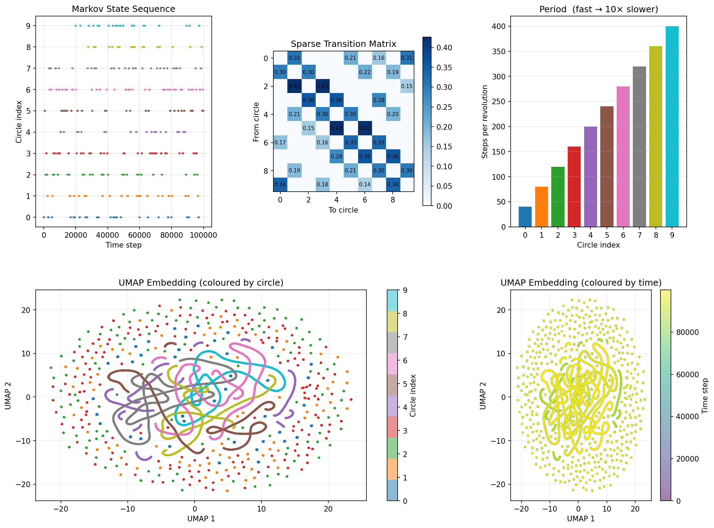
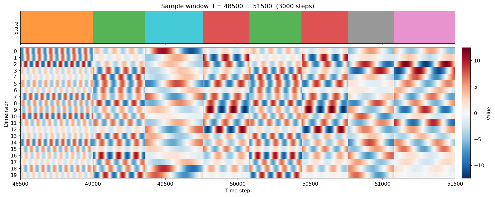
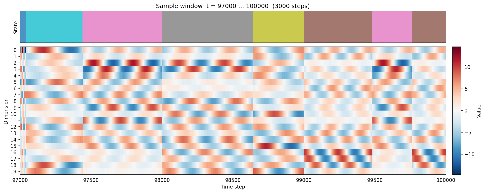
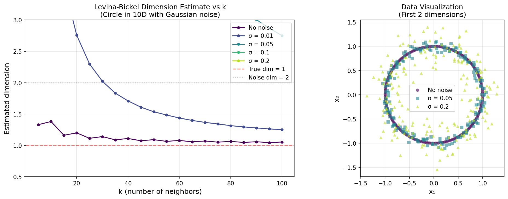

# Synthetic Song

Synthetic syllable-based time series on circles in high-dimensional space, with Markov switching dynamics and Levina-Bickel intrinsic dimension estimation.

## Overview

This project generates a time series that mimics syllable-structured sequential data (like birdsong). A point traverses one of 10 circles embedded in 20-dimensional space, switching between circles according to a sparse Markov transition matrix. Each circle has a fixed angular velocity, producing distinct oscillation frequencies that serve as a signature for each "syllable."

### Key properties

- **10 circles** in 20D ambient space, each in its own random 2D sub-plane, all sharing the same center (origin)
- **Statistically similar radii** (~20), large enough that the circular signal spans all dimensions
- **Fixed angular velocity per circle**, with periods ranging from 40 steps (fastest) to 400 steps (slowest) — a 10x speed range
- **~400 step dwell time** per visit, achieved by varying the number of complete revolutions (quantised to whole laps so entry/exit angles are fixed)
- **Sparse off-diagonal transition matrix** with ring connectivity plus long-range shortcuts

## Scripts

### `markov_circles_timeseries.py`

Generates the Markov-switching circle time series with optional UMAP visualisation.

```bash
python markov_circles_timeseries.py            # full run with UMAP
python markov_circles_timeseries.py --no-umap  # skip UMAP (much faster)
```

### `levina_bickel_demo.py`

Demonstrates the Levina-Bickel MLE intrinsic dimension estimator on a noisy circle, showing how the estimate depends on the neighbourhood scale `k` and noise level.

```bash
python levina_bickel_demo.py
```

## Results

### Markov-switching time series summary



**Top row:** Markov state sequence over time, sparse transition matrix, and per-circle period (steps per revolution).
**Bottom row:** UMAP embedding coloured by circle index and by time step. Slow circles (long period) form coherent loops; fast circles appear as scattered points because consecutive time steps are far apart on the circle.

### Sample data windows

Raw 20-dimensional time series with state labels. Each column is one time step; each row is one ambient dimension. The coloured strip at top shows which circle is active.






### Levina-Bickel dimension estimation



Estimated intrinsic dimension vs neighbourhood size `k` for a circle in 10D with varying noise levels. Without noise the estimator correctly finds dimension ~1. With noise, small `k` overestimates (noise dominates) and large `k` recovers the manifold.

## Requirements

```
numpy
scipy
matplotlib
umap-learn
```

Install into a virtual environment:

```bash
python -m venv venv
source venv/bin/activate
pip install numpy scipy matplotlib umap-learn
```
